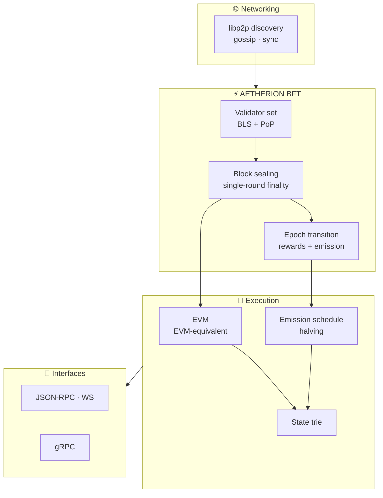
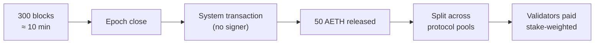

<div align="center">

<br>

# ⬢ &nbsp;A E T H E R I O N &nbsp; B F T

### The Byzantine fault tolerant consensus client powering the **Aetherion Network**

**Sub-second finality** &nbsp;·&nbsp; **EVM-equivalent** &nbsp;·&nbsp; **Native AETH** &nbsp;·&nbsp; **Operator-free emission**

<br>

[](./LICENSE)
[](#-network-parameters)
[](#-architecture)
[](https://go.dev)

<br>

[**Quickstart**](#-quickstart) &nbsp;•&nbsp; [**Bootstrap nodes**](#-bootstrap-nodes) &nbsp;•&nbsp; [**Run a validator**](#️-run-a-validator) &nbsp;•&nbsp; [**Explorer**](https://explorer.aetherion-ai.org) &nbsp;•&nbsp; [**RPC**](https://rpc.aetherion-ai.org)

<br>

</div>

---

> [!IMPORTANT]
> **Economics you don't have to trust.**
> Block production, validator rewards and the entire AETH emission are executed by the chain itself,
> as part of producing each block. There is no privileged wallet that "runs" the distribution, and no
> step where a human can redirect it. Every number the network reports can be replayed by anyone
> against a public RPC.

<br>

## ✨ Highlights

|             | Capability | What it means |
| :---------: | :--------- | :------------ |
| ⚡ | **AETHERION BFT consensus** | Optimistic fast-path validator agreement with single-round finality for the vast majority of blocks. Byzantine fault tolerant, with deterministic guarantees. |
| 🔷 | **EVM-equivalent execution** | Existing Ethereum contracts, tooling and wallets run unchanged. No rewrites, no surprises. |
| 🪙 | **Native AETH** | AETH is the network's native asset: gas, staking, governance and rewards, all in one unit. |
| 📉 | **Deterministic emission** | A fixed genesis supply and a per-epoch reward that only ever halves, on a published schedule. Monetary policy is a formula, not a meeting. |
| 🛡️ | **Capped validator power** | Stake-weighted rewards with hard-capped voting weight, so no operator can seize the chain regardless of stake. |
| 🔐 | **BLS-secured validator set** | Proof-of-possession verified BLS keys secure the validator set and every epoch transition. |

<br>

## 🌐 Network parameters

<div align="center">

| Parameter | Value |
| :-- | :-- |
| **Network** | Aetherion Network |
| **Chain ID** | `100892` |
| **Native currency** | `AETH` — 18 decimals |
| **Consensus** | AETHERION BFT |
| **Total supply** | `21,000,000 AETH` — fixed at genesis |
| **Epoch length** | `300` blocks · ~10 minutes |
| **Emission** | `50 AETH` / epoch, halving every `210,240` epochs (~4 years) |
| **Public RPC** | <https://rpc.aetherion-ai.org> |
| **Explorer** | <https://explorer.aetherion-ai.org> |

</div>

<br>

## 🏗 Architecture



Each epoch is a fixed span of **300 blocks**. At its boundary the protocol emits a *system
transaction*: no wallet signs it and no person presses a button. Releasing the reward and splitting
it is simply part of producing the block.



<br>

## ⚡ Quickstart

**Requirements:** Go `1.20+`, `make`, and a C toolchain.

```bash
git clone https://github.com/AETHERION-AI-org/aetherion-bft.git
cd aetherion-bft
go build -o aetherion-bft .
```

This produces the `aetherion-bft` node binary in the working directory.

<br>

## 🔗 Bootstrap nodes

A new node syncs from genesis by dialing the network's bootstrap nodes, then discovers the rest of
the validator set automatically.

```text
/ip4/89.167.111.230/tcp/1478/p2p/16Uiu2HAmLoUGNMxjpdZfPuq6NGhSCiZivGQw9GEh8BaMXA3vUwW4
/ip4/46.224.18.225/tcp/1478/p2p/16Uiu2HAkzpcTyxTZG92G3P53xatp8BAXucakaTPmQHL6ErHF992z
```

### Run a full node

```bash
./aetherion-bft server \
  --data-dir ./aetherion-data \
  --chain genesis.json \
  --libp2p 0.0.0.0:1478 \
  --jsonrpc 0.0.0.0:8545 \
  --bootnode /ip4/89.167.111.230/tcp/1478/p2p/16Uiu2HAmLoUGNMxjpdZfPuq6NGhSCiZivGQw9GEh8BaMXA3vUwW4 \
  --bootnode /ip4/46.224.18.225/tcp/1478/p2p/16Uiu2HAkzpcTyxTZG92G3P53xatp8BAXucakaTPmQHL6ErHF992z \
  --log-level INFO
```

> [!TIP]
> Once synced, the node serves a standard Ethereum JSON-RPC endpoint on `http://127.0.0.1:8545`.
> Point any Ethereum library, wallet or explorer at chain ID `100892` and it works out of the box.

<br>

## 🛡️ Run a validator

<details>
<summary><b>Expand: validator setup</b></summary>

<br>

Validators produce blocks and earn stake-weighted rewards.

**1. Generate the node's keys** *(writes locally; only public identifiers are ever printed)*

```bash
./aetherion-bft secrets init --data-dir ./aetherion-data
```

**2. Read the public identifiers to register on-chain**

```bash
./aetherion-bft secrets output --data-dir ./aetherion-data
```

This prints your **address**, **BLS public key** and **Node ID**. Register these with the on-chain
validator registry.

**3. Run with sealing enabled**

```bash
./aetherion-bft server \
  --data-dir ./aetherion-data \
  --chain genesis.json \
  --libp2p 0.0.0.0:1478 \
  --jsonrpc 0.0.0.0:8545 \
  --seal \
  --log-level INFO
```

> [!CAUTION]
> Your validator private keys live in `--data-dir` and must **never** leave the machine. Only the
> public address, BLS public key and Node ID are ever shared.

Voting weight is capped per validator: additional stake increases rewards but never grants a single
operator control of consensus.

</details>

<br>

## 📉 Emission schedule

The per-epoch reward can only ever shrink. It is arithmetic, not a decision.

<div align="center">

| Era | Reward / epoch | Approx. duration |
| :-: | :-- | :-- |
| **1** | `50.0000 AETH` | now → ~4 years |
| **2** | `25.0000 AETH` | ~4 → ~8 years |
| **3** | `12.5000 AETH` | ~8 → ~12 years |
| **4** | `6.2500 AETH` | ~12 → ~16 years |
| **…** | halving every `210,240` epochs | → `21,000,000 AETH` cap |

</div>

<br>

## 📁 Repository layout

| Path | Contents |
| :-- | :-- |
| `consensus/` | AETHERION BFT engine, validator set, epoch logic |
| `state/` | EVM execution, state trie, emission & halving schedule |
| `blockchain/` | Block import, storage, canonical chain |
| `txpool/` | Transaction pool and gossip |
| `jsonrpc/` | JSON-RPC and WebSocket API |
| `network/` | libp2p peer-to-peer networking and discovery |
| `crypto/` · `bls/` | ECDSA and BLS cryptography, proof-of-possession |
| `command/` | The `aetherion-bft` CLI (`server`, `secrets`, `genesis`, …) |
| `server/` | Node assembly and lifecycle |
| `contracts/` | System and network contract bindings |

<br>

## 🔒 Security

Found a vulnerability? Please report it responsibly — see [`SECURITY.md`](./SECURITY.md).
Do **not** open a public issue for security-sensitive reports.

<br>

## 📄 License

Licensed under the **Apache License 2.0**. See [`LICENSE`](./LICENSE).

<br>

<div align="center">

<sub>⬢ &nbsp;Built for a network whose numbers you can check yourself.</sub>

</div>
